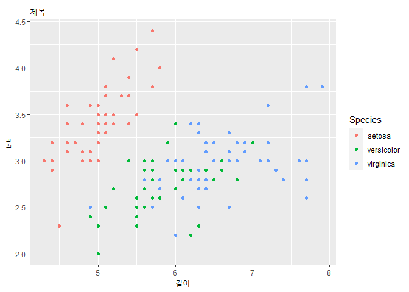
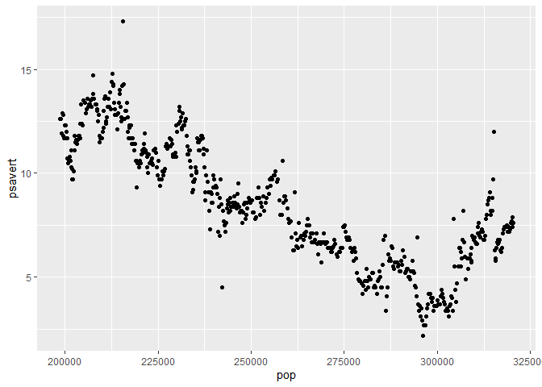
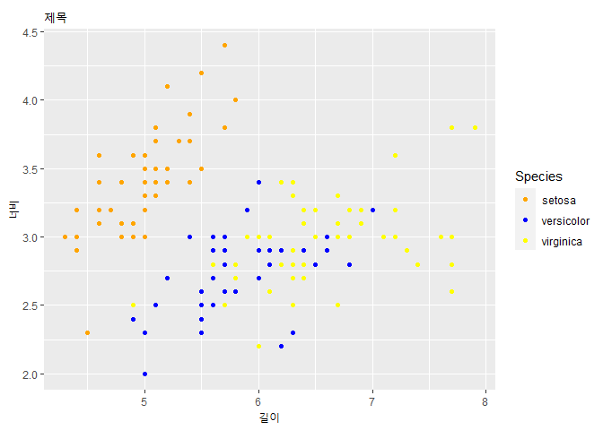

## 복습

iris데이터, sepal.length, sepal.width 활용해서 종류별로 산점도를 그리세요.
- 제목과 x축, y축을 변경하세요.
 + x축은 길이, y축 너비 
 

```r
library(readxl)
library(ggplot2)
library(nycflights13)
library(tidyverse)
```

```
## ── Attaching packages ─────────────────────────────────────── tidyverse 1.3.1 ──
```

```
## ✔ tibble  3.1.7     ✔ dplyr   1.0.9
## ✔ tidyr   1.2.0     ✔ stringr 1.4.0
## ✔ readr   2.1.2     ✔ forcats 0.5.1
## ✔ purrr   0.3.4
```

```
## ── Conflicts ────────────────────────────────────────── tidyverse_conflicts() ──
## ✖ dplyr::filter() masks stats::filter()
## ✖ dplyr::lag()    masks stats::lag()
```
 

```r
str(iris)
```

```
## 'data.frame':	150 obs. of  5 variables:
##  $ Sepal.Length: num  5.1 4.9 4.7 4.6 5 5.4 4.6 5 4.4 4.9 ...
##  $ Sepal.Width : num  3.5 3 3.2 3.1 3.6 3.9 3.4 3.4 2.9 3.1 ...
##  $ Petal.Length: num  1.4 1.4 1.3 1.5 1.4 1.7 1.4 1.5 1.4 1.5 ...
##  $ Petal.Width : num  0.2 0.2 0.2 0.2 0.2 0.4 0.3 0.2 0.2 0.1 ...
##  $ Species     : Factor w/ 3 levels "setosa","versicolor",..: 1 1 1 1 1 1 1 1 1 1 ...
```


```r
ggplot(iris, aes(x=Sepal.Length, y=Sepal.Width, colour = Species))+
  geom_point()+
  labs(
    title = "제목",
    x =  "길이",
    y = "너비"
  )
```

<!-- -->


```r
ggplot(economics, aes(x=pop, y=psavert))+
  geom_point()
```

<!-- -->
- 색상변경

```r
ggplot(iris, aes(x=Sepal.Length, y=Sepal.Width, colour = Species))+
  geom_point()+
  labs(
    title = "제목",
    x =  "길이",
    y = "너비"
  )+
  scale_color_manual(
    labels = c("setosa", "versicolor", "virginica"),
    values = c("orange", "blue", "yellow")
  )
```

<!-- -->

## 통계
 - 기술통계: 평균, 최소값, 최댓값, 중간값
 - 추론통계: 변수 간의 관계를 파악/새로운 사실을 발견(=추정)
  + 평균 차이 검정
   - 가설검정: 각그룹간 평균의 차이를 검정
   - 남자(그룹)의 평균키와 여자(그룹)의 평균키는 차이가 있을 것이다.
   
  + 교차분석 (= 빈도분석)
   - 가설검정: 각 범주별 빈도를 활용해서 관계성을 검정
  + 상관관계 분석
   - 수치데이터
   - 두 변수간에 상관관계가 있느냐 없느냐?
  + 단순회귀분석
   - 1차방정식 y(종속변수)=a(기울기)x+b(상수항)
   - x값이 y값에 영향을 주는것인가?
   - 예)기온, 판매량 
   - 가설검정
    + 기온(독립변수)가 판매량(종속변수)에 영향을 주고 있을 것이다. 
  
##통계 검정
- P.176
## 가설
- Hypothesis
- 연구: 내가 궁금한 것을 찾는 것
- 남자와 여자가 키가 동일하다는 

- 귀무가설: 두 그룹간의 평균 차이가 없다.
- 대립가설: 두 그룹간의 평균 차이가 있다. 

- 가설검정에서 인정하는 유의수준
 + 5%(0.05), 1%(0.01), 0.1%(0.001) 또는 10%(0.1)
 
오차범위 내에 있는지 없는지 

남자 평균 키와 여자 평균 키 실험
유의 수준 > 0.05

t.test
- 어떻게 데이터를 입력하는지 확인
- p-value, 유의수준 0.05이상: 귀무가설, 0.05이내: 대립가설


```r
mpg1 <- read.csv("data/mpg1.csv", stringsAsFactors = F)
str(mpg1)
```

```
## 'data.frame':	234 obs. of  5 variables:
##  $ manufacturer: chr  "audi" "audi" "audi" "audi" ...
##  $ trans       : chr  "auto" "manual" "manual" "auto" ...
##  $ drv         : chr  "f" "f" "f" "f" ...
##  $ cty         : int  18 21 20 21 16 18 18 18 16 20 ...
##  $ hwy         : int  29 29 31 30 26 26 27 26 25 28 ...
```

-시각화

```r
library(ggplot2)
ggplot(mpg1, aes(x = trans, y = cty))+
  geom_boxplot()
```

<!-- -->

- t.test 검정
 + 귀무가설: auto와 manual의 cty 평균은 차이가 없다.
 + 대립가설: auto와 manual의 cty 평균은 차이가 있다.

```r
t.test(data = mpg1, cty ~ trans)
```

```
## 
## 	Welch Two Sample t-test
## 
## data:  cty by trans
## t = -4.5375, df = 132.32, p-value = 1.263e-05
## alternative hypothesis: true difference in means between group auto and group manual is not equal to 0
## 95 percent confidence interval:
##  -3.887311 -1.527033
## sample estimates:
##   mean in group auto mean in group manual 
##             15.96815             18.67532
```

```r
                  # 종속변수 ~ 독립변수
                  # 반응변수 ~ 설명변수
                  # y         x
```

- 두 그룹의 평균 차이 검정
 + 사전 필수 검증
 + 등분산 검정
  + 두 그룹간의 분산이 비슷하면 --> t.test (모수검정)
  + 두 그룹간의 분산이 다르다면 --> 비모수 검정
  + 귀무가설: 두 그룹간의 분산이 비슷하다.
    대립가설: 두 그룹산의 분산이 다르다. 
  

```r
var.test(data = mpg1, cty ~ trans)
```

```
## 
## 	F test to compare two variances
## 
## data:  cty by trans
## F = 0.73539, num df = 156, denom df = 76, p-value = 0.1101
## alternative hypothesis: true ratio of variances is not equal to 1
## 95 percent confidence interval:
##  0.4912917 1.0719468
## sample estimates:
## ratio of variances 
##          0.7353887
```


```r
ggplot(mpg1, aes(x=cty, fill=trans))+
  # geom_histogram()+
  geom_density(alpha = 0.1)
```

<!-- -->


## 교차 분석
 - 범주형 변수들이 관계가 있다는 것을 검정
 - 비율의 차이가 있는지 검정
 - 교차분석 검정은 R의 chisq.test()함수로 진행
 - 귀무가설: test에 따라 drv(4,f,r)의 비율 차이가 없다 
 - 대립가설: test에 따라 drv(4,f,r)의 비율 차이가 있다
 - 빈도표 / 비율
 

```r
table(mpg1$trans, mpg1$drv) #교차분석
```

```
##         
##           4  f  r
##   auto   75 65 17
##   manual 28 41  8
```
 
 - 비율

```r
prop.table(table(mpg1$trans, mpg1$drv),1)
```

```
##         
##                  4         f         r
##   auto   0.4777070 0.4140127 0.1082803
##   manual 0.3636364 0.5324675 0.1038961
```
 
 - auto 4륜 구동(4)인 47.8%
 - manual 전륜구동(f) 53.2% 가장 많음
 - 실제 통계적으로 봤을때, 차이가 있는지 검정
 - 귀무가설: test에 따라 drv(4,f,r)의 비율 차이가 없다 
 - 대립가설: test에 따라 drv(4,f,r)의 비율 차이가 있다


```r
chisq.test(mpg1$trans, mpg1$drv)
```

```
## 
## 	Pearson's Chi-squared test
## 
## data:  mpg1$trans and mpg1$drv
## X-squared = 3.1368, df = 2, p-value = 0.2084
```

  
  
  
  
  
  
  
  
  
